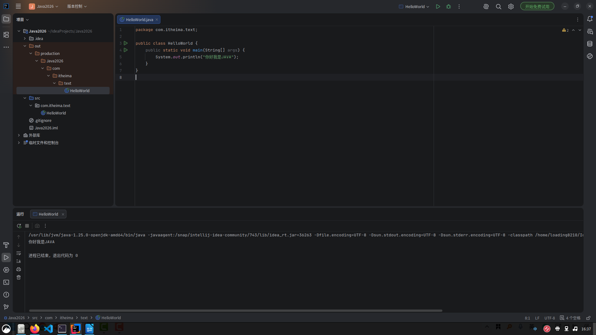
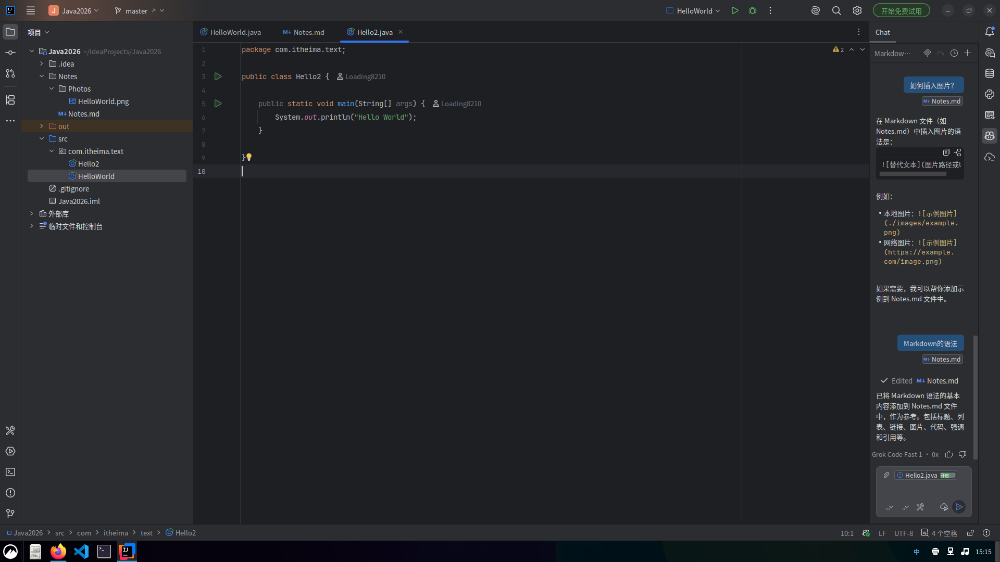
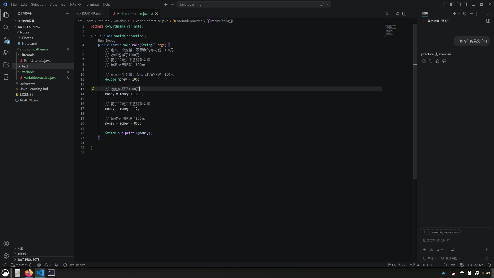
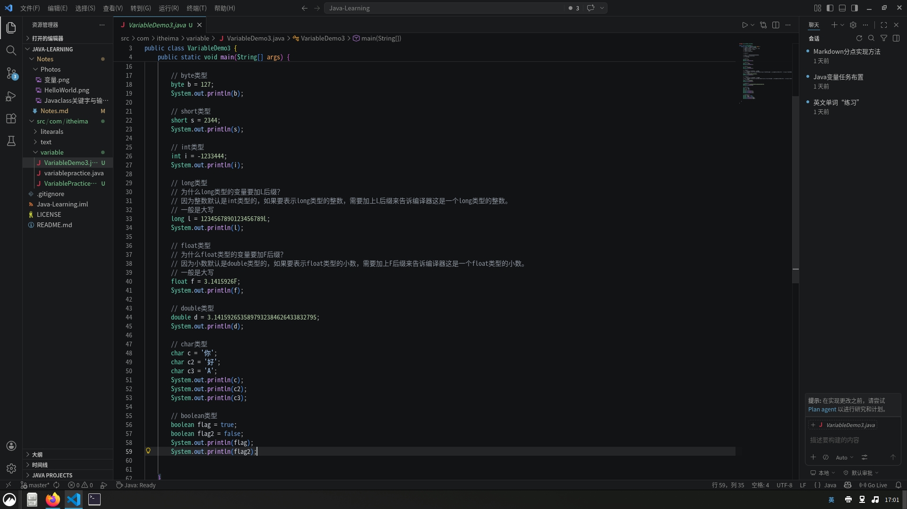
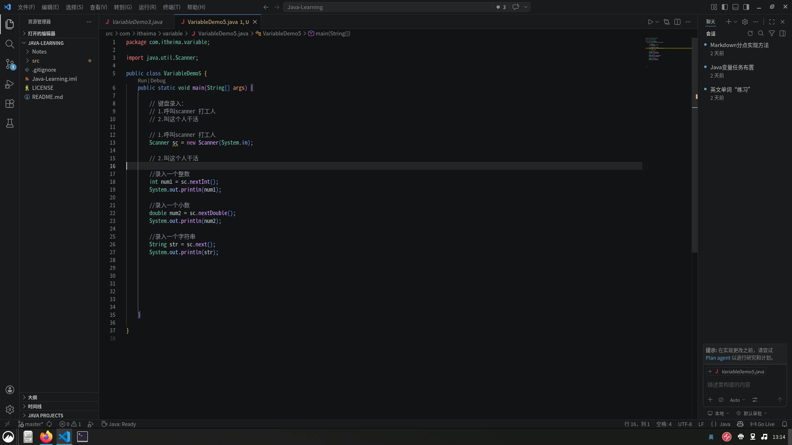
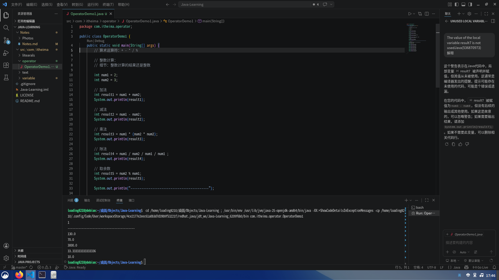
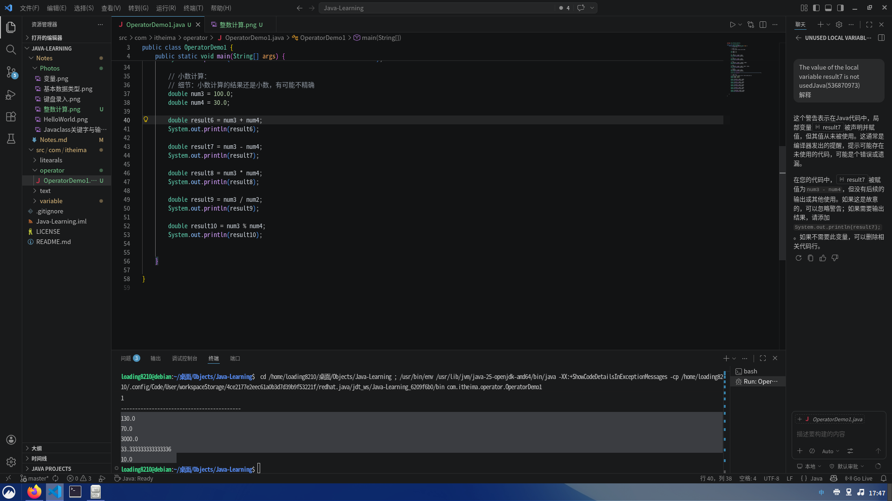
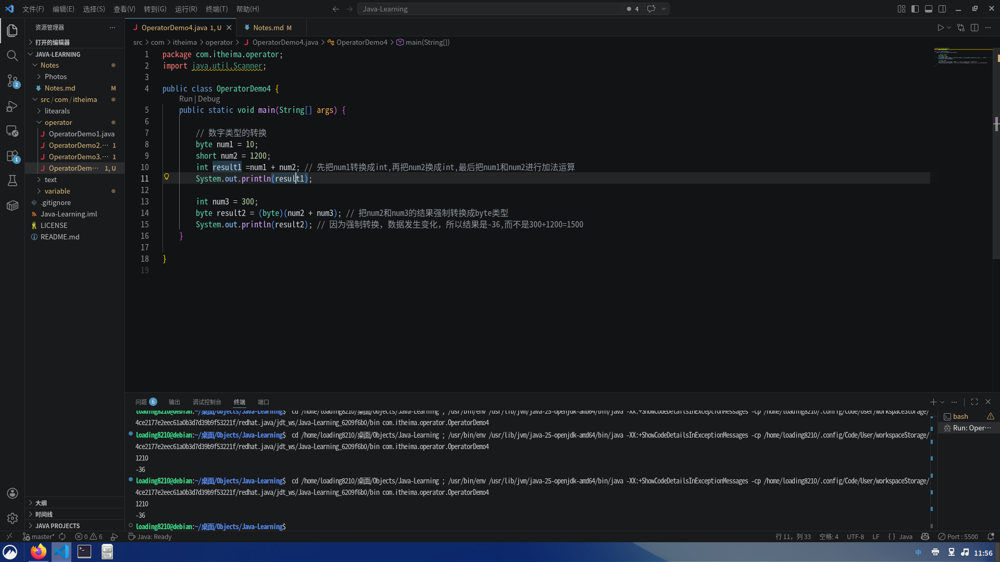
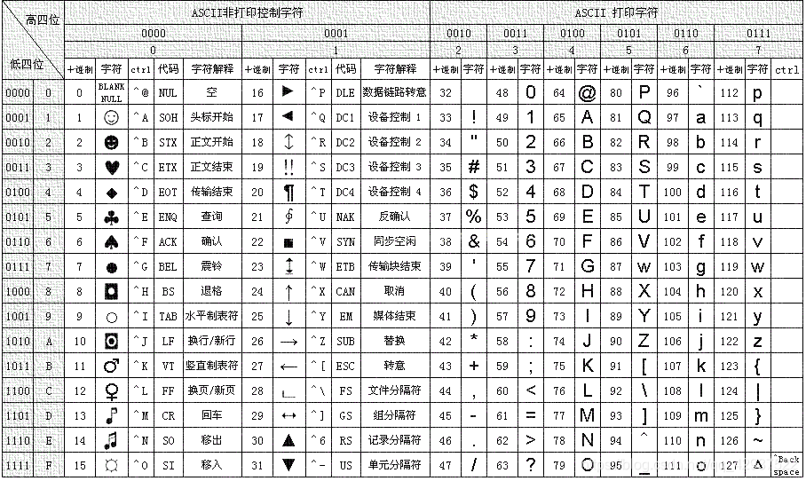
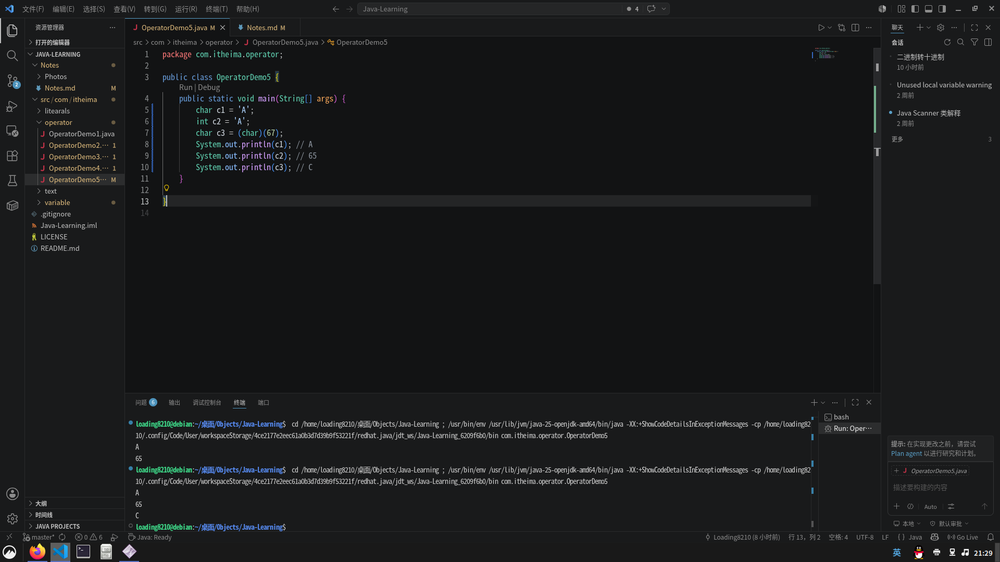

# 2026-04-25 Notes

## IDEA 新建项目
- 编辑项目名称、位置等
- 创建 Java 的 "包"、文件
- "最简单的程序"：psvm 回车 sout 回车

- 

## 注释

### 类型
- `// 单行注释`
- `/* 多行注释 */`
- `/** 文档注释 */`

### 细节
- 注释的颜色修改：设置 → 编辑器 → 配色方案 → 语言默认设置
- 注释的快捷键：
  - 单行注释：Ctrl + /
  - **!** 多行注释：Ctrl + Shift + /
- 注释运行规则：程序不管注释内容，不影响运行
- 注释的嵌套：**别嵌套**

# 2026-04-26 Notes 

## 关键字

- 关键字：Java 语言中具有特殊意义的单词，不能用作变量名、方法名、类名等标识符。

## packge: 定义一个包
- `packge name;`
- `packge 包名;`
- **属于这个包name**

## class: 定义一个类
- 类：Java项目中最基本的组成单元

## class格式：

- ``public class Hello2 {
 }``
- `public`: 访问修饰符，表示这个类可以被任何其他类访问
- `class`: 关键字，表示这是一个类的定义
- `Hello2`: 类名
- `{ }`: 表示范围

##  public static void main(String[] args) {}
- `` public static void main(String[] args) {
    }``
- 这是Java程序的**主入口**，程序从此往下逐行运行
- 请勿修改` public static void main(String[] args) {}`中的任何内容，否则程序无法正常运行

## System.out.println("Hello World");
- `System.out.println("Hello World");`
- Java的**输出/打印**语句，用于在控制台打印文本
- 这一代码的快捷方式：**sout** 回车

## AI辅助学习使用方法
1. **定规则**
2. **拆业务**
3. **逐个实现**
4. **排除BUG**
5. **运行**

# 2026-04-40 Notes

## 字面量(litearals)

**字面量**：程序中的数据

**字面量类型**：
1. 整数类型
2. 浮点数类型(小数类型)
3. 字符串类型
4. 字符类型
5. 布尔类型
6. 空类型

| 类型    | 写法              | 举例                             |
|-------|-----------------|--------------------------------|
| 整数类型(int)  | 直接写             | 1, -5, 100                     |
| 浮点数类型(double) | 直接写，加小数点        | 3.14, -0.001, 2.0              |
| 字符串类型 | 使用双引号包引         | "Hello, World!", "Java", "123" |
| 字符类型  | 使用单引号包引单个字符     | 'A', 'b', '1'                  |
| 布尔类型  | 只有两个,ture或false | true, false                    |
| 空类型   | 特殊类型，空值         | null                           |

# 2026-05-01 Notes

## 变量(variable)

### **变量**：存储数据的小空间，并非数据，表示一个经常变化的数据
### **变量的定义格式**：
- **数据类型 变量名 = 数据值**
  - int a = 10
- **数据类型**：为空间中存储的数据，加入类型**限制**
  - **整型**：int , **浮点数**：double
- **注意事项**：
1.变量只能存一个值
2.变量不允许重复定
3.变量使用前一定要进行赋值
4.一条语句可以定义多个变量，也可以连续赋值 

## 计算机的存储规则（数字）
1. 在计算机中，任意数据都是以二进制的形式来存储的

- **进制** ：十进制——逢十进一   二进制——逢二进一

  - 二进制的运算过程：
    **0**：二进制中的 **0**
    **1**：二进制中的 **1**
    **2**：二进制中的 **10**
    **3**：二进制中的 **11**
    **4**：二进制中的 **100**

2. 在计算机中，不同类型的数据有不同的存储单元

- 一个“**0**”或一个“**1**”叫做一个比特位(**bit**)
- 8bit = 1字节   ——字节是最小的存储单元
- int类型的占4字节   ——会在数字前面补“**0**”占满 **32bit**

3. 在Java中，int整数类型占**4字节**/**32bit**
- 例：若要表示十进制的“1”，会用“**00000000 00000000 00000000 00000001**” 

# 2026-05-02 Notes
## Java中的基本数据类型

### **整数**：**byte**,**short**,**int**,**long**
- 如果用这些类型表示十进制的整数“1”，那么会这样表示：

  - **byte**：00000001
  - **short**: 00000000 000000001
  - **int**: 00000000 00000000 00000000 00000001
  - **long**：00000000 00000000 00000000 00000000 00000000 00000000 00000000 00000001

### 小数：float，double
- 所占字节如下：
  - float：4字节
  - double：8字节

(所占字节数不同，能表示的数的范围也不同)

### 字符（区别字符串）：char
- 占2字节

### 布尔：boolean
- 占1字节(true,false)

基本数据类型的数字取值范围大小关系：
``double > float > long > int > short > byte``
`long`,`float`的细节:在取的数末尾分别加`L`和`F`后缀

## Java中的引用数据类型
### 字符串：String

# 2026-05-03 Notes
## 标识符
**标识符**：代码中所有我们自己取的名字
包括：**类名**，**变量名**，**方法名**等

### 标识符起名规则
- 硬性要求：
  - 由数字，字母，下划线“_”，“$”组成
  - 不以数字开头
  - 不能是关键字
  - 区分大小写

- 软性建议：
  - 见名知义，驼峰命名
  - **小驼峰**：方法名 , 变量名
    - 仅一个单词时：小写 
      - `apple`
    - 多个单词时：一个单词小写开头，后面的单词大写开头
      - `appleCount`
  - **大驼峰**：类名
    - 全部单词以大写开头
      - `HelloWorld`
## 键盘录入

**键盘录入**：获取键盘输入的数据，并保存到变量中
步骤：
1. **找到Scanner**
2. **让Scanner干活**

### 找到Scanner
- 导入Scanner:`import java.util.Scanner;`
- 呼叫打工人:`Scanner sc = new Scanner(System.in);`
### 叫这个人干活(定义一个变量名来保存录入数据):
  - `int num1 = sc.nextInt();` ——录入整数
  - `double num2 = sc.nextDouble()` ——录入小数
  - `String str = sc.next()` ——录入字符串

# 2026-05-04 Notes
## 运算符
**运算符**包括：**算术运算符**，**自增自减运算符**，**赋值运算符等**
### 算术运算符：+ , - , *(乘) , /(除) , %(取余数)
1. 整数计算

  - 细节：整数计算的结果还是整数，如：10/3 = 3
2. 小数计算

  - 细节：小数直接参与计算，结果有可能不精确
#### 数值拆分
**公式**：
`int num = 12345;`
- 拆个位：`int ge = num % 10`
- 拆十位：`int shi = num / 10 % 10;`
- 拆百位：`int bai = num / 100 % 10`
- 拆千位：`int qian = num / 1000 % 10`
- 拆万位：`int wan = num / 10000 % 10`
- 以此类推

# 2026-05-16
## 算术运算符

### 数字运算
- `数字运算`：**类型不一样，不能直接计算，需要转换成同类型的才能计算**
- 根据取值范围的大小：**由小变大（隐性转换）**，**由大变小（强制转换）**
#### 隐性转换
- 结构：
`byte num1 = 12;`
`short num2 = 23;`
`int result = num1 + num2;`
**为什么`result`是int类型？**
Java中，如果byte和short类型的数字参与计算，会自动把类型转换成int类型，再计算
把byte和short转换成int会在前面补0，如
`byte`: `000000111` -> `int`:`00000000 00000000 00000000 000000111`
`short`: `00000000 00001011` -> `int`:`00000000 00000000 00000000 00001011`
- 如果出现：
`byte num1 = 10;`
`double num2 = 20.5`
`double result = num1 + num2;`
这种情况，**取值范围小的**会转换成**取值范围大的**

如果你要两个int的运算结果是byte类型，你就需要：

#### 强制转换
- 结构：
`int num1 = 300;`
`int num2 = 700;`
`byte result = (byte)(num1 + num2); // 前面加“(byte)”说明要转换的数据类型是byte，num1 + num2加括号表示整体`
这里预计的结果应为1000，但应为强制转换删去了int的前面的3字节
`int`:`00000000 00000000 00000001 00101100`-> `byte`:`00101100`
前面的3字节直接去掉了，所以强制转换是会改变数据值的

### 字符运算
**重要** ASCII 码表

- 结构：
`char a = 'A';`// A对应65
`int num1 = 2;`// 2
`System.out.println(a+ num1);`// 67
**实际输出`67`**
每一个字符在ASCII码表中都有唯一对应的数字值，字符的底层就是数字，所以字符可以与其他数字进行运算

### 字符串
**概述**：任何数据类型和字符串相加(+)所做的都是拼接操作
结构：
        ``System.out.println(1+2+"Mine" + "craft"+2+2);``
        ``// 1 + 2 = 3``
        ``// 3 + "Mine" = "3Mine"``
        ``// "3Mine" + "craft" = "3Minecraft"``
        ``// "3Minecraft" + 2 = "3Minecraft2"``
        ``// "3Minecraft2" + 2 = "3Minecraft22"``
前面的1+2属于是整数运算``1+2=3``
